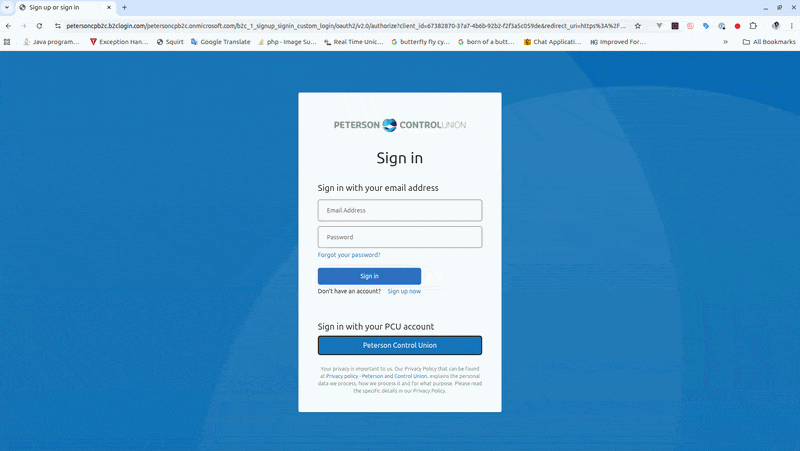

# Demo Tap




A Chrome extension that draws an elegant ripple wherever you click — built for screen recordings, walkthroughs, and live demos.

## Features

- Ring / Solid / Pulse ripple styles
- Color picker plus 8 curated presets
- Adjustable size and duration
- Optional cursor halo that follows the pointer
- Settings sync across Chrome via `chrome.storage.sync` and update live
- Works on already-open tabs the moment the extension loads — no per-tab reload needed

## Build & package

The `Makefile` handles everything: install deps, compile TypeScript, copy assets, and produce both an unpacked `build/` folder and an uploadable `demo-tap.zip`.

```bash
make            # default: install + build + package
make build      # compile TS + copy assets into build/
make package    # produce build/ and demo-tap.zip
make clean      # remove build/ and demo-tap.zip
```

Requires `node`/`npm` and the `zip` CLI.

Outputs:

- `build/` — unpacked extension, ready to load in Chrome for development.
- `demo-tap.zip` — upload this to the Chrome Web Store Developer Dashboard.

## Load unpacked (development)

1. Run `make build`.
2. Open `chrome://extensions`.
3. Enable **Developer mode** (top-right).
4. Click **Load unpacked** and select the `build/` folder.
5. Pin the **Demo Tap** action and click it to open settings.

## Publish (production)

1. Run `make` to produce `demo-tap.zip`.
2. Upload `demo-tap.zip` at the [Chrome Web Store Developer Dashboard](https://chrome.google.com/webstore/devconsole).

## Project layout

```
src/            TypeScript sources (background, content, popup, shared)
icons/          Extension icons (16/32/48/128)
build/          Packaged unpacked extension (generated — compiled JS + assets)
manifest.json   Manifest V3
popup.html      Extension popup UI
popup.css       Popup styles
Makefile        Build & package pipeline
```

## How it works

- A Manifest V3 **content script** (`content.js`) draws the ripple and tracks pointer position. It listens to `chrome.storage.onChanged` so the popup's settings apply live.
- A **service worker** (`background.js`) runs `chrome.scripting.executeScript` on `onInstalled` and `onStartup`, injecting the content script into tabs that were already open. That's why no manual reload is required.
- The **popup** (`popup.js`) reads/writes settings via `chrome.storage.sync`.
